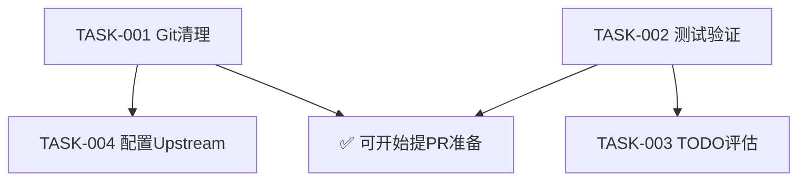

# Iteration 4 计划 (2026-04-19)

## 项目状态总结

### 当前状态：🟡 需要关注

| 维度 | 状态 | 说明 |
|------|------|------|
| 编译 | ✅ 通过 | cargo check 成功 |
| 测试 | ⏳ 待验证 | 需运行 cargo test |
| Git | ⚠️ 有分歧 | main 与 origin/main 分歧 (11 vs 4 commits) |
| 未提交改动 | 9个文件 | tasks/ 系统文件 + 文档迁移 |
| Upstream | ❌ 未配置 | 无法获取上游最新 |
| 代码质量 | ⚠️ 10个 TODO/FIXME | 主要在 core/query.rs |

### 最近工作回顾

最近10次提交全部聚焦于 **ValveOS 文档系统建设**：
- 命名系统为 ValveOS
- 添加断点续传机制
- 半自动唤醒协议
- 功能索引跳板表
- 日志系统同步
- 文档审计与引用修复

**结论**：ValveOS 基础设施已基本完善，应转向实际代码贡献。

---

## 识别的问题与机会

### 🔴 问题（需解决）

1. **Git 分支混乱**
   - main 与 origin/main 分歧
   - 9个未提交文件
   - upstream 未配置

2. **代码库 TODO 积压**
   - 10个 TODO/FIXME 散落在核心模块
   - query.rs 占 7 个（context compact、shell issue、memory_content 等）

3. **测试状态未知**
   - 编译通过但测试未运行
   - 需要建立基线

### 🟡 机会（可改进）

1. **query.rs 重构**
   - 多个 TODO 指出函数过长、职责不清
   - context compact 机制需要重新设计

2. **bash.rs shell 工具**
   - 明确标注 "should be re implemented"
   - Windows 兼容性问题

3. **Upstream 同步**
   - 配置 upstream 后可以跟踪上游动态
   - 为未来 PR 做准备

---

## 任务列表

### TASK-ITER4-001: Git 状态清理与同步 [P0]
- **描述**: 清理未提交改动、解决分支分歧、配置 upstream
- **负责人**: Housekeeper + Planner
- **期望结果**:
  - 所有 tasks/ 改动已提交
  - 分支状态干净
  - upstream 已配置
- **值得提 PR**: 否（内部整理）
- **依赖**: 无

### TASK-ITER4-002: 测试基线验证 [P0]
- **描述**: 运行完整测试套件，建立当前测试状态基线
- **负责人**: Coordinator → Worker
- **期望结果**:
  - `cargo test` 完整输出记录
  - 失败测试清单（如有）
  - 测试覆盖率概览
- **值得提 PR**: 否（验证性质）
- **依赖**: 无

### TASK-ITER4-003: 核心模块 TODO 评估与分类 [P1]
- **描述**: 分析 10 个 TODO/FIXME，按影响范围和难度分类
- **负责人**: Planner
- **期望结果**:
  - TODO 分类表（按优先级/难度/上游价值）
  - 识别可提交上游的改进项
  - 更新 backlog.md
- **值得提 PR**: 部分可能
- **依赖**: TASK-ITER4-002（测试通过后更安全）

### TASK-ITER4-004: 配置 Upstream 远程仓库 [P1]
- **描述**: 配置 git upstream 指向上游仓库
- **负责人**: Worker
- **期望结果**:
  - `git remote -v` 显示 upstream
  - `git fetch upstream` 成功
  - 了解上游最新动态
- **值得提 PR**: 否（配置性质）
- **依赖**: TASK-ITER4-001（Git 清理后）

---

## 任务依赖关系

## 预期结果

1. **短期**（本次迭代）：
   - Git 仓库状态健康
   - 测试基线建立
   - TODO 清单分类完成
   - Upstream 配置完成

2. **中期**（下次迭代）：
   - 基于 TODO 分类选择高价值任务实施
   - 开始为上游贡献代码

3. **PR 可行性评估**：

| 潜在PR | 上游价值 | 改动范围 | 建议 |
|--------|----------|----------|------|
| query.rs context compact 重构 | 高 | 中等（1-2文件） | ✅ 值得，需先 Issue |
| bash.rs shell 工具重写 | 高 | 中等（1-2文件） | ✅ 值得，需先 Issue |
| Windows shell 路径修复 | 中 | 小（1文件） | ✅ 可快速提交 |
| config/app.rs project_root_markers | 低 | 极小 | ⏸️ 先搞清楚用途 |

---

## 风险与缓解

| 风险 | 概率 | 影响 | 缓解措施 |
|------|------|------|----------|
| 测试失败导致阻塞 | 中 | 高 | 先修测试再继续 |
| Upstream 配置问题 | 低 | 中 | 检查网络和权限 |
| TODO 评估耗时 | 低 | 低 | 限制在核心模块 |
| Git 清理冲突 | 低 | 中 | 先备份再操作 |

---

*计划制定时间: 2026-04-19*
*制定者: Planner Agent*
